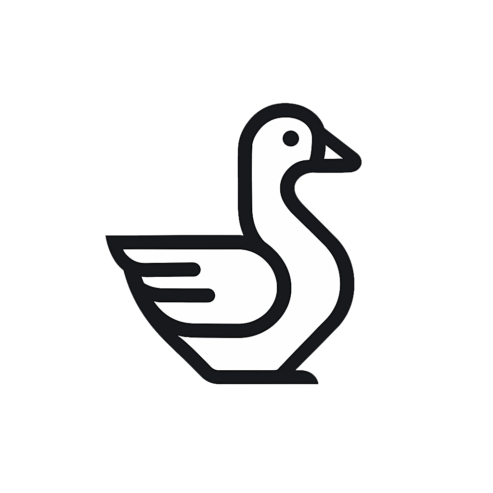
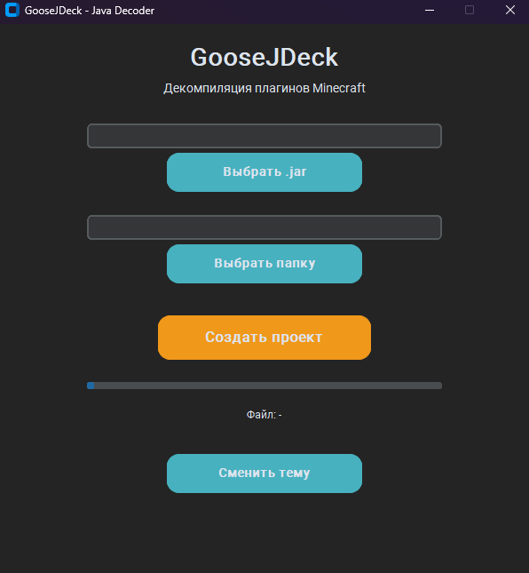
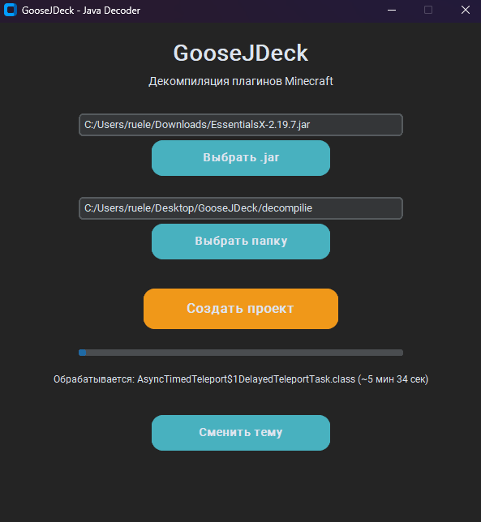

# GooseJDeck 🦢 - Java Plugin Decompiler

 <!-- Здесь потом вставишь ссылку на логотип -->

**GooseJDeck** — это программа для быстрого декомпилирования Java-плагинов Minecraft в полноценный проект для IntelliJ IDEA или Maven.  
Работает без установки Python и без лишних файлов — только один `.exe`!

---

## 🚀 Возможности:

- 📂 Выбор .jar файла и папки через удобный интерфейс.
- 🎯 Декомпиляция каждого `.class` файла через встроенный `cfr.jar`.
- 🕒 Оценка оставшегося времени обработки.
- 🧪 Автоматическое определение версии сервера (Spigot API).
- 📄 Генерация `pom.xml` при отсутствии.
- 🌑 Темная и светлая тема интерфейса.
- ✅ Полностью независимый `.exe` (не требует установленного Python).
- 🦢 Красивый стильный интерфейс GooseLife.

---

## 📥 Установка:

1. Скачать файл `GooseJDeck.exe` из [релизов](#).
2. Просто запустить `GooseJDeck.exe`.
3. Всё! Без установки, без зависимостей!

---

## 📸 Скриншоты:

| Главное окно | Процесс декомпиляции |
|:-------------|:--------------------:|
|  |  |
